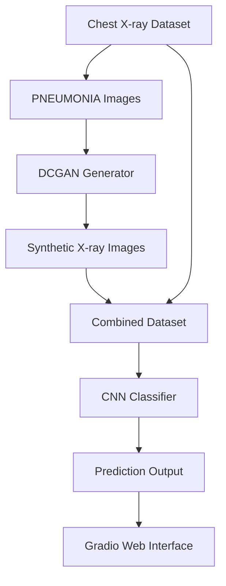
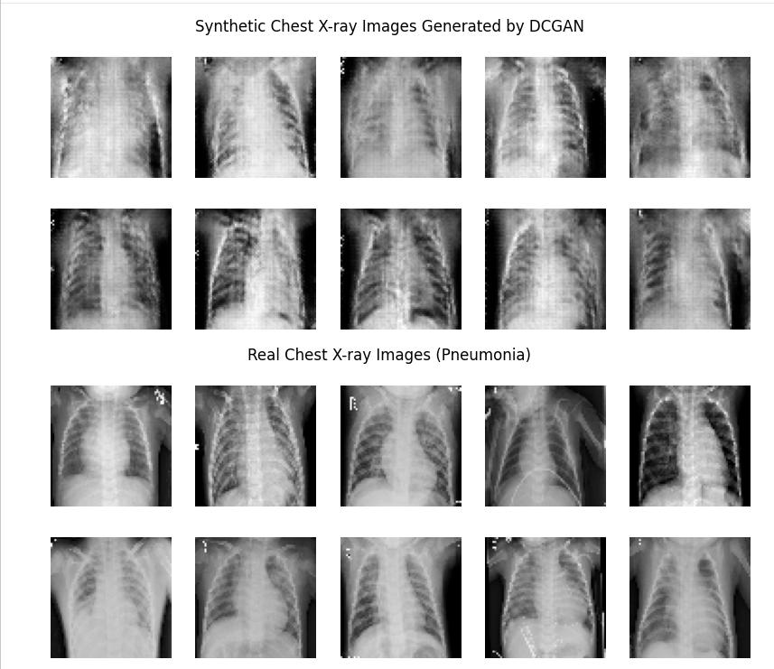
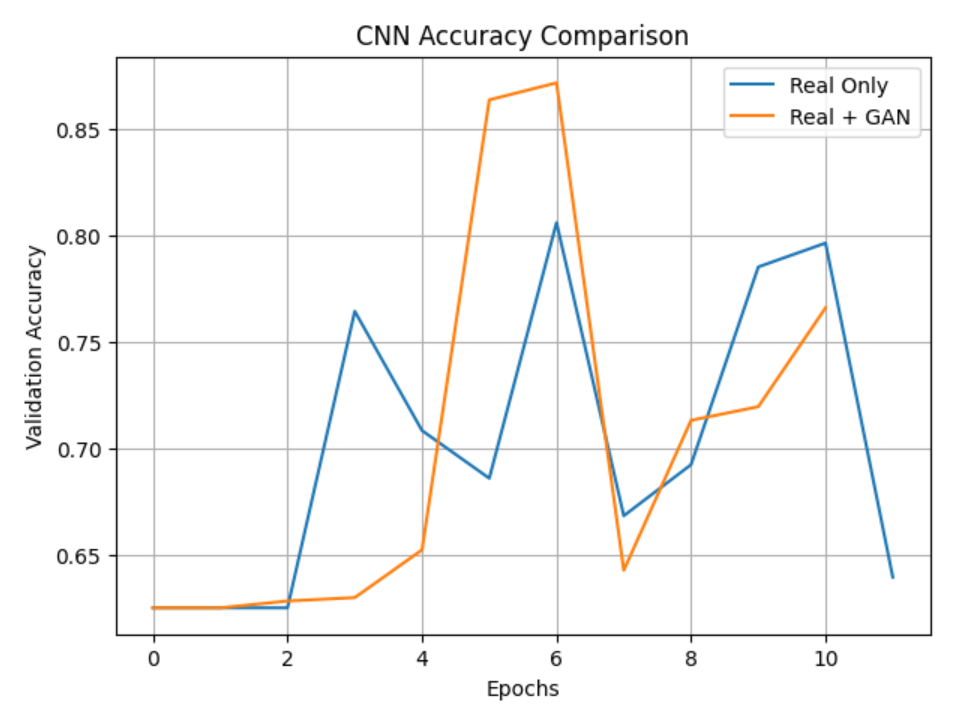
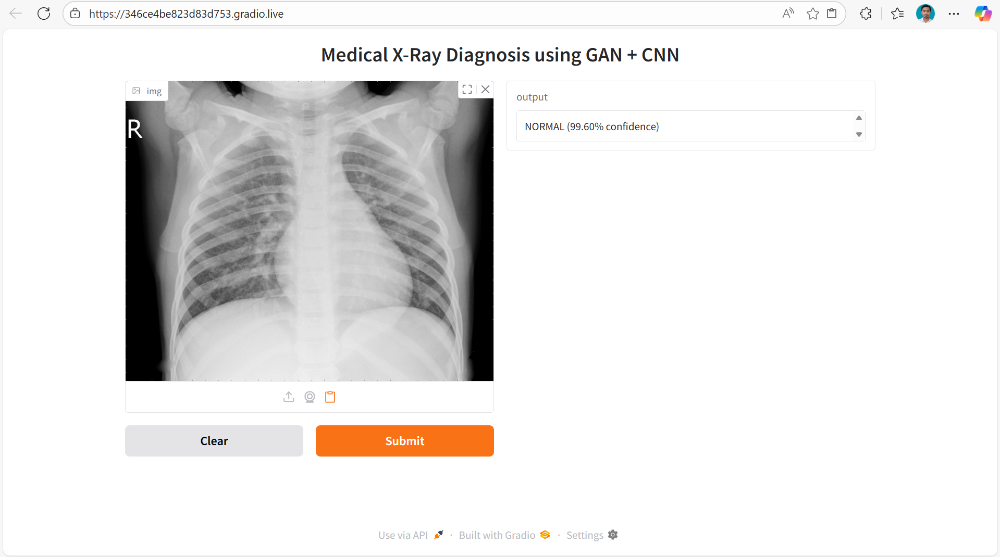
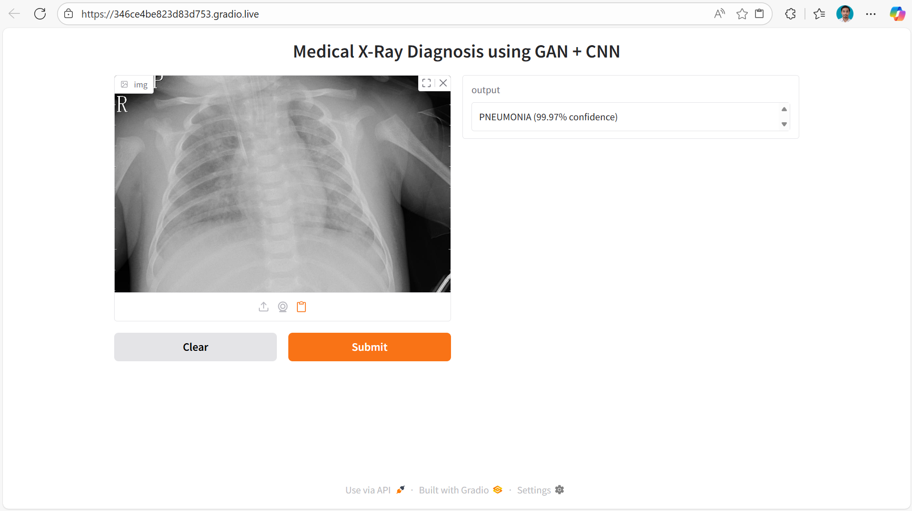

# 🧠 Medical Image Data Augmentation Using DCGAN with CNN Classification

This project demonstrates how GAN-based synthetic medical image generation can improve disease classification performance in data-scarce and imbalanced medical datasets. A DCGAN is used to generate synthetic pneumonia chest X-ray images, which are combined with real data to train a CNN classifier, followed by an interactive Gradio-based web UI for real-time prediction.

---

## ✨ Key Features

- DCGAN-based synthetic medical image generation
- Data imbalance handling using GAN augmentation
- CNN classifier trained on real vs real + GAN data
- Performance comparison using accuracy curves
- Visualization of real and GAN-generated X-ray images
- Interactive Gradio web interface
- TPU / GPU acceleration support
- Applicable to real-world medical diagnosis scenarios

---

## 🧠 Tech Stack

| Component         | Technology                |
| ---------------- | ------------------------ |
| Language         | Python 3                 |
| Deep Learning    | TensorFlow / Keras       |
| Array Ops        | NumPy                    |
| Image Processing | OpenCV                   |
| Visualization    | Matplotlib               |
| GAN Model        | DCGAN (Gen + Disc)       |
| Classifier       | CNN (Custom)             |
| Deployment & UI  | Gradio                   |
| Acceleration     | TPU / GPU (tf.distribute.Strategy) |

---

## ⚙️ Architecture Overview



---

## 🔄 Project Workflow

1. **Dataset Collection**
2. **Data Cleaning & Preprocessing**
3. **DCGAN Training (Pneumonia Images Only)**
4. **Synthetic Image Generation**
5. **Dataset Augmentation (Real + GAN)**
6. **CNN Training (Baseline & Augmented)**
7. **Performance Comparison**
8. **Gradio-based Medical Diagnosis UI**

---

## 🧪 Model Comparison Strategy

| Model Type    | Training Data         | Purpose             |
|--------------|----------------------|---------------------|
| CNN (Baseline) | Real Images Only     | Benchmark accuracy  |
| CNN + GAN     | Real + Synthetic Images | Measure improvement |

✔ Accuracy improved by ~6% using GAN augmentation

---

## 🖥️ Screenshots

| GAN Generated Chest X-rays                | Real Chest X-rays                      |
|:-----------------------------------------:|:--------------------------------------:|
|  |  |

| CNN Accuracy Comparison                   | Gradio Web Interface (1)               | Gradio Web Interface (2)               |
|:-----------------------------------------:|:--------------------------------------:|:--------------------------------------:|
|  |  |  |


---

## 📂 Project Structure

```bash
📦 Medical-GAN-XRay
 ┣ 📜 README.md
 ┣ 📓 DCGAN_CNN_Medical_XRay.ipynb
 ┣ 📂 chest_xray/
 ┃ ┣ 📂 train/
 ┃ ┣ 📂 test/
 ┃ ┗ 📂 val/
 ┣ 📂 gan_images/
 ┃ ┗ 📂 PNEUMONIA/
 ┣ 📂 combined_train/
 ┃ ┣ 📂 NORMAL/
 ┃ ┗ 📂 PNEUMONIA/
 ┗ 📂 screenshots/
```

---

## 🛠️ How to Run the Project

### 1. Clone the Repository

```bash
git clone https://github.com/your-username/Medical-GAN-XRay.git
cd Medical-GAN-XRay
```

### 2. Open Notebook

Run the notebook in Google Colab / Kaggle / Jupyter with GPU or TPU enabled.

### 3. Install Dependencies

```bash
pip install tensorflow opencv-python matplotlib gradio kagglehub
```

### 4. Run All Cells

- DCGAN trains first
- CNN trains on real & augmented data
- Gradio UI launches at the end

---

## 🏁 Conclusion

- DCGAN effectively generates realistic pneumonia X-ray images
- GAN-based augmentation improves CNN classification accuracy
- Demonstrates a practical medical AI pipeline
- Suitable for clinical decision-support research

**📊 Using DCGAN-based augmentation improved CNN accuracy from 80.61% → 86.38% (~6%)**

**🤖 Developed with passion by Nakul — Advancing Deep Learning for Medical Imaging**